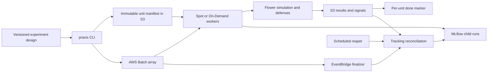

# Federated learning under reconnecting malicious clients

A reproducible research testbed and AWS experiment harness for studying Byzantine defenses when malicious federated-learning clients change identities, disconnect, and change attack strategies.

The implementation combines **Flower + PyTorch**, configurable RMC scenarios, temporal and supervised detectors, and a fingerprint registry. The **`praxis` experiment harness** connects a versioned experiment design to AWS Batch units, durable S3 artifacts, and MLflow records. Spot interruption recovery, explicit missing-cell refills, and automated tracking repair support long experiment sweeps.

This release contains software, frozen instruments, selected final numerical evidence, and newly written reproduction documentation. The dissertation manuscript and private research working materials are not part of the release. **Software: MIT, Erik Jones, 2026. Processed dataset: CC BY 4.0 with upstream attribution.**

## Start here

| Goal | Guide |
|---|---|
| Install and verify the source checkout | [Installation](docs/installation.md) |
| Obtain and prepare the underlying dataset | [Data and split compatibility](docs/data.md) |
| Inspect final results or reproduce the research | [Reproduction guide](docs/reproduction/README.md) |
| Understand or deploy the experiment harness | [Harness guide](docs/harness/README.md) |
| Understand the release's provenance and scope | [Release notes](docs/release.md) |
| Understand or extend the code | [Code guide](docs/code-guide.md) · [Contributing](CONTRIBUTING.md) |

## What the experiments found

| Study | Question | Recorded outcome |
|---|---|---|
| H1 | Do combined early-life signal features clear the required improvements over individual feature families? | Criteria not met at development-frozen cuts targeting 10% FPR (scenario-mean realized FPR 0.05–0.11). The combined family never gains 5 percentage points over the better single family in S2–S4. |
| H2 | Does the tenure-gated ensemble meet the detection and comparison requirements under RMC? | Falsified in the tested regimes. Development and held-out results are reported separately. |
| H2′ | Can a supervised detector generalize across held-out attack families? | Confirmed at its registered operating budget: held-out S4 recall 0.5020 at realized FPR 0.1026. Lower-FPR performance is reported separately. |
| H3 | Can a transmission-feature fingerprint link a returning identity to its device? | Corrected instrument supported at ceiling: 80/80 malicious re-entry links in each of S3 and S4. This establishes linkage in the simulated partition setting. |
| H4 | Does detector + identity + Krum improve utility over Krum? | Falsified: S1 passed; S2, S3 and S4 failed. |
| H4′ | Does detector + identity over FedAvg improve utility over undefended FedAvg? | **Proposed and unrun.** No confirmatory result or fresh seed cohort is claimed. |

Read the [per-study guides](docs/reproduction/README.md) for denominators, frozen configurations, scoring rules, evidence files, and limitations. A successful detector or identity test does not establish an effective composition. The existing no-Krum contrasts in H4 are descriptive; they are not a substitute for H4′.

## Architecture



A completed S3 commit is the durable unit boundary. An interrupted, uncommitted unit **restarts from the beginning**; there is no mid-training checkpoint resume. Completed units skip on their markers. The finalizer and reaper reconstruct or reconcile MLflow state from durable evidence. See the recovery guide for concurrency and infrastructure limits.

## Repository layout

```text
flowerfl/          Flower client/server, detectors, fingerprinting and telemetry
rmc/               Scenario inputs, temporal ensemble and fixed evaluation
praxis_exp/        CLI, manifests, Batch submission, S3 commit and MLflow repair
scripts/           Simulation, preprocessing, calibration and scoring entry points
scripts/aws/       Infrastructure and container build/deployment tooling
docker/            Worker and repair-function images
data/              Frozen seeds, splits, feature locks and serving bundle
models/            Selected fitted research instruments
reproduction/      Public evidence, protocols and reproduction inputs
tests/             Offline scientific and harness regression tests
docs/              Installation, data, reproduction and harness guides
```

Reproduction has two levels: verify the distributed evidence and instruments without cloud resources, or acquire compatible data and execute new experiment fleets in your own account. The private MLflow service and original S3 bucket are not public dependencies. Exact raw-to-verdict replay requires the underlying per-unit artifacts; summary JSONs alone do not provide those inputs.

## Citation

Use [CITATION.cff](CITATION.cff) and cite the exact release or commit used. The software citation does not publish or license the excluded dissertation text. Dataset and third-party software terms remain with their respective authors.
