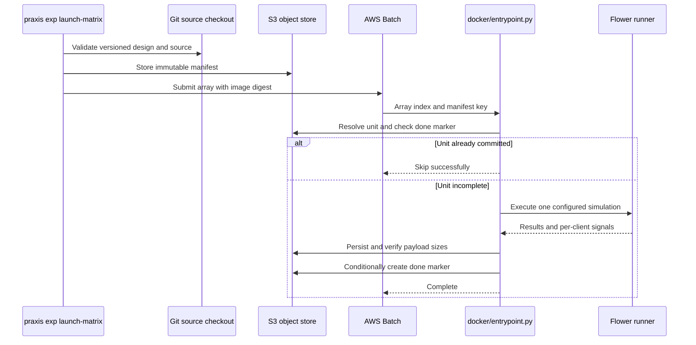

# Code guide

## Execution path

The command-line harness reads an experiment's YAML front matter, validates its matrix and repository state, and creates deterministic unit identities. Each unit carries a scenario, defense configuration, optimizer mode, seed, and run settings. The launcher pins the worker image by digest and stores the expanded manifest before submitting the Batch array.

| Module | Responsibility and contract |
|---|---|
| `praxis_exp/matrix_doc.py` | Parse matrix documents; reject malformed run settings before submission. |
| `praxis_exp/units.py` | Expand matrices and construct stable unit identities. |
| `praxis_exp/manifest.py` | Serialize the complete unit census and provenance. |
| `praxis_exp/matrix_launch.py` | Validate source/image inputs, publish the manifest, and submit the array. |
| `praxis_exp/matrix_refill.py` | Validate and resubmit the missing-unit set against the original manifest. |
| `praxis_exp/integrity.py` | Commit result and signal payloads before the done marker. |
| `praxis_exp/enrich.py` | Reconstruct MLflow records from durable artifacts. |
| `praxis_exp/selfheal_lambda.py` | Respond to terminal Batch events and reconcile stale tracking runs. |
| `docker/entrypoint.py` | Coordinate one unit, its MLflow run, termination handling, artifacts and completion. |
| `scripts/run_phase4_flower.py` | Translate a research configuration into the Flower simulation and outputs. |

## Scientific components

`flowerfl/client_app.py` implements client training and emits the measurements that feed the detector and fingerprint paths. `flowerfl/task.py` owns datasets, splits, preprocessing, model construction, and training helpers. `flowerfl/persistent_optimizer.py` controls whether optimizer state survives communication rounds.

`flowerfl/scenario_strategy.py` maps the scenario schedule onto participating identities and attack behavior. The discovery round and the scenario's round numbering are distinct; do not shift one to the other when joining signals. `rmc/scenarios/` contains the schedules; legacy names such as `S0_clean_baseline` and `S1_benign_churn_only` still describe attack-bearing controls in the final design.

`flowerfl/byzantine_defense.py` composes aggregation and detector plugins. `rmc/tg_ensemble.py` supplies the cold-start/long-memory decision rule and temporal expert. The final supervised H2′ serving path is in `flowerfl/h2prime_online.py`; it loads a hash-verified model, frozen feature order and calibrated cuts. H2′ is distinct from both TGE and the unsuccessful TGE′ development variant.

`flowerfl/fingerprint.py` defines feature extraction and encoding. `fingerprint_emission.py` constructs the emitted device signature. `fingerprint_registry.py` checks the calibration artifact and compares signatures; `fingerprint_plugin.py` applies the configured registry policy. The corrected H3 metric uses the locked feature mask and covariance calibration, not a newly fitted distance for every evaluation run.

`rmc/fixed_eval.py` and `rmc/sealed_test_eval.py` load the versioned evaluation manifests. Those manifests refer to rows in specific processed partitions. See [data compatibility](data.md) before substituting a newly prepared dataset.

## Output and diagnostics

Per-round metrics, signal JSONL, provenance records, warnings, and completion markers are part of the reproducibility and recovery interface. They are operational output, and downstream scorers and MLflow enrichment depend on their schemas. Keep result production enabled for research runs.

Tests use small synthetic inputs and fake cloud clients. They do not establish that a fresh AWS deployment or a complete scientific fleet has been executed. Full-data anchors, real-Ray tests and strict numerical protocol checks have separate resource or environment requirements.

The public release excludes dissertation builders, ad hoc cloud probes, historical deployment migrations, scratch notebooks and private planning records. Retained protocol modules under `reproduction/protocol/` are executable dependencies of the frozen scorers. Historical path strings inside canonical golden metadata identify the original instrument; the files themselves have been relocated into the public protocol directory.

## Extending the software

Add a defense as an explicit configuration with a named plugin chain, then verify strategy construction, signal attribution, scoring direction, and unit identity. Extend the matrix allowlist and image-level contract tests when adding a run option; a parsed CLI option is insufficient unless it reaches the worker and is recorded in provenance.

When changing retry behavior, test interruption before and after the S3 commit boundary and duplicate execution. When changing a scientific instrument, create a new version and calibration record. Do not change a frozen golden expectation or weaken a custody check simply to obtain a passing score.
