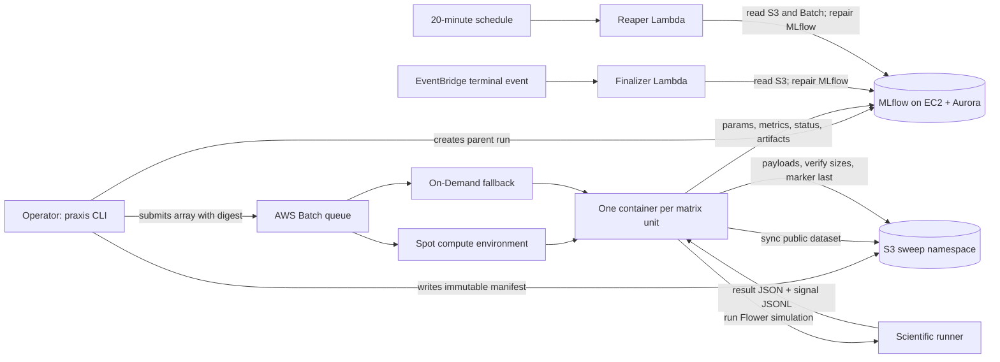

# Experiment harness architecture

The harness maps a reviewed experiment matrix to independent AWS Batch units.
S3 is the durable system of record for completion; MLflow is the searchable
metadata and visualization layer. Training images and self-heal images are
addressed by registry digest.

Each array index resolves through the canonical S3 manifest to a deterministic
unit ID derived from defense, scenario, execution mode, seed, and optional
replicate. The container receives the experiment ID, artifact bucket, MLflow
URI, image digest, launch commit, scenario directory, and parent run ID as Batch
environment values. It does not receive static AWS credentials.

The deployment has four trust boundaries:

- The operator identity may build images, write manifests, create MLflow parent
  runs, and submit arrays.
- The Batch job role can read the dataset and read/write experiment artifacts in
  the configured bucket.
- The MLflow host role can fetch the managed Aurora secret and read/write its S3
  artifact prefix.
- The self-heal Lambda role can read sweep state, repair MLflow artifacts, and
  query Batch status. It cannot submit jobs.

The CloudFormation templates intentionally accept VPC, subnet, security-group,
bucket, capacity, ownership, and image values as parameters. No original AWS
account, address, profile, hostname, or personal tag is present in the release.

