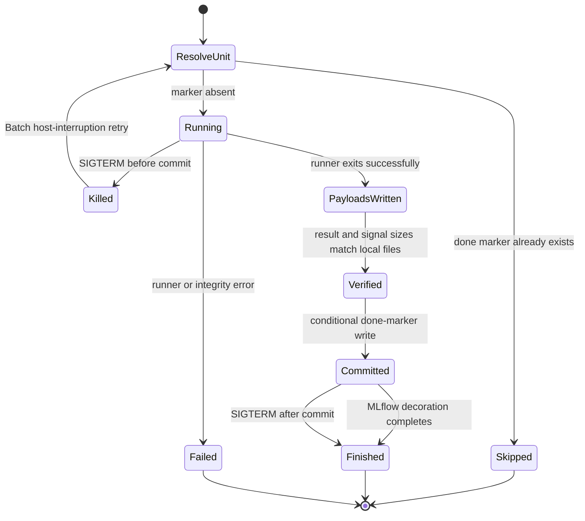

# Recovery and durability guarantees

The fleet uses deterministic retry from the beginning of a matrix unit. It does
not checkpoint model or optimizer state during a unit. A Spot interruption can
therefore lose all work since that unit began.

## Implemented guarantees

`praxis_exp.integrity.persist_unit` uploads the result and signal payloads,
checks that each remote object exists with the expected byte length, and writes
an empty done marker last with `If-None-Match: *`. Readers use the marker as the
commit point. On retry, `docker/entrypoint.py` checks that marker before any
MLflow call, so an already committed unit exits successfully even if MLflow is
unavailable.

The Batch job definition retries only host-interruption failures matching the
`Host EC2*` status reason, up to ten attempts. Other failures exit instead of
looping. The queue prefers diversified Spot capacity and can spill to a bounded
On-Demand compute environment.

Before the marker is committed, SIGTERM marks the child MLflow run `KILLED` and
exits 143. After the marker is committed, the same signal records `FINISHED`
because S3 already proves durable success. A retry resumes the existing child
MLflow run when lookup succeeds; this keeps multiple Batch attempts under one
unit record.

The EventBridge finalizer and 20-minute reaper repair MLflow from committed S3
artifacts. They read the sweep namespace and write MLflow; they never create a
done marker or submit replacement compute. Missing cells are tagged loudly on
the parent. An explicit `launch-matrix --refill` resubmits the original full
array; committed cells skip and only markerless cells perform training.

## Limits and operational implications

- There is no mid-unit checkpoint. Capacity and timeout choices must allow a
  complete unit to finish within one attempt.
- The skip predicate checks marker existence. It does not hash or re-download
  payloads on every skip. Bucket versioning and an independent post-sweep
  integrity audit are recommended.
- Concurrent duplicate attempts can both upload deterministic payloads before
  one wins the conditional marker write. The design relies on deterministic
  units; it is not a general transaction for nondeterministic writers.
- Verification compares byte length, not content hash. Frozen-input and result
  checksum manifests provide the separate content-integrity layer.
- Self-healing repairs MLflow presentation and lifecycle state. It cannot repair
  missing S3 payloads or complete an interrupted unit.
- A parent without its Batch job-ID tag cannot be proven terminal by the reaper.
  The finalizer has a `DescribeJobs` fallback, but sustained delivery/API failure
  can require a manual `praxis exp enrich` pass. The supplied EventBridge target
  has no dead-letter queue.
- Lambda serialization is per function. An advisory MLflow tag narrows the
  remaining finalizer/reaper overlap; it is not an atomic distributed lock.
- Refill bookkeeping after Batch submission is best effort. Review returned
  warnings and verify the parent `batch_array_job_id` and durable refill record
  before trusting later automated reconciliation.

These limits are why completion is decided from the S3 manifest and done-marker
census, with MLflow treated as a repairable index over that durable record.

